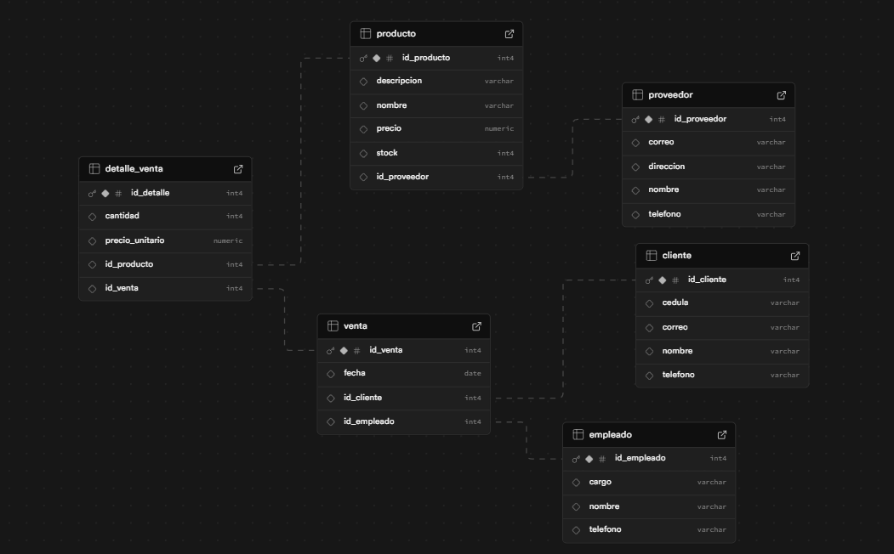

Imagen de la base Papeleria en supabase



# 📦 Sistema de Ventas - Línea 3 Papelería

Este proyecto es un sistema de ventas desarrollado con **Spring Boot** que gestiona empleados, clientes, productos, proveedores, ventas y detalles de ventas. La aplicación se conecta a una base de datos relacional con las siguientes entidades:

- **Empleado**
- **Cliente**
- **Producto**
- **Proveedor**
- **Ventas**
- **Detalle de Venta**

---

## 🔍 Consultas implementadas

A continuación se documentan las funcionalidades específicas del sistema y cómo fueron implementadas:

---

### 1️⃣ Listar las ventas realizadas por un empleado

**Ruta HTTP:**  
`GET /venta/empleado/{idEmpleado}`

**Descripción:**  
Obtiene todas las ventas que ha realizado un empleado específico.

**Implementación:**

- **Repository**
```java
List<Venta> findByEmpleadoIdEmpleado(Integer idEmpleado);
```

- **Service**
```java
public List<Venta> listarVentasPorEmpleado(Integer idEmpleado) {
    return ventaRepository.findByEmpleadoIdEmpleado(idEmpleado);
}
```

- **Controller**
```java
@GetMapping("/empleado/{idEmpleado}")
public List<Venta> ventasPorEmpleado(@PathVariable Integer idEmpleado) {
    return ventaService.listarVentasPorEmpleado(idEmpleado);
}
```

---

### 2️⃣ Mostrar los productos que ofrece un proveedor

**Ruta HTTP:**  
`GET /producto/proveedor/{idProveedor}`

**Descripción:**  
Muestra los productos asociados a un proveedor en específico.

**Implementación:**

- **Repository**
```java
List<Producto> findByProveedorIdProveedor(Integer idProveedor);
```

- **Service**
```java
public List<Producto> obtenerProductosPorProveedor(Integer idProveedor) {
    return productoRepository.findByProveedorIdProveedor(idProveedor);
}
```

- **Controller**
```java
@GetMapping("/proveedor/{idProveedor}")
public List<Producto> productosPorProveedor(@PathVariable Integer idProveedor) {
    return productoService.obtenerProductosPorProveedor(idProveedor);
}
```

---

### 3️⃣ Mostrar ventas realizadas de un empleado a un cliente

**Ruta HTTP:**  
`GET /venta/empleado/{idEmpleado}/cliente/{idCliente}`

**Descripción:**  
Devuelve las ventas realizadas por un empleado a un cliente determinado.

**Implementación:**

- **Repository**
```java
List<Venta> findByEmpleadoIdEmpleadoAndClienteIdCliente(Integer idEmpleado, Integer idCliente);
```

- **Service**
```java
public List<Venta> obtenerVentasPorEmpleadoYCliente(Integer idEmpleado, Integer idCliente) {
    return ventaRepository.findByEmpleadoIdEmpleadoAndClienteIdCliente(idEmpleado, idCliente);
}
```

- **Controller**
```java
@GetMapping("/empleado/{idEmpleado}/cliente/{idCliente}")
public List<Venta> ventasPorEmpleadoYCliente(@PathVariable Integer idEmpleado, @PathVariable Integer idCliente) {
    return ventaService.obtenerVentasPorEmpleadoYCliente(idEmpleado, idCliente);
}
```

---

### 4️⃣ Mostrar detalles de ventas hechas por un empleado a un cliente

**Ruta HTTP:**  
`GET /detalleventa/empleado/{idEmpleado}/cliente/{idCliente}`

**Descripción:**  
Retorna todos los detalles de ventas (productos vendidos, cantidad, precio unitario, etc.) asociadas a ventas hechas por un empleado a un cliente específico.

**Implementación:**

- **Repository**
```java
@Query("SELECT dv FROM DetalleVenta dv " +
       "JOIN dv.venta v " +
       "WHERE v.empleado.idEmpleado = :idEmpleado AND v.cliente.idCliente = :idCliente")
List<DetalleVenta> findDetallesByEmpleadoAndCliente(@Param("idEmpleado") Integer idEmpleado,
                                                     @Param("idCliente") Integer idCliente);
```

- **Service**
```java
public List<DetalleVenta> obtenerDetallesPorEmpleadoYCliente(Integer idEmpleado, Integer idCliente) {
    return detalleVentaRepository.findDetallesByEmpleadoAndCliente(idEmpleado, idCliente);
}
```

- **Controller**
```java
@GetMapping("/empleado/{idEmpleado}/cliente/{idCliente}")
public List<DetalleVenta> detallesPorEmpleadoYCliente(@PathVariable Integer idEmpleado,
                                                      @PathVariable Integer idCliente) {
    return detalleVentaService.obtenerDetallesPorEmpleadoYCliente(idEmpleado, idCliente);
}
```

---

## 📁 Estructura del proyecto

```
com.example.linea3_papeleria
│
├── Configuration
│   └── SwaggerConfiguration
│
├── Controller
│   ├── ClienteController
│   ├── DetalleVentaController
│   ├── EmpleadoController
│   ├── ProductoController
│   ├── ProveedorController
│   └── VentaController
│
├── Model
│   ├── Cliente
│   ├── DetalleVenta
│   ├── Empleado
│   ├── Producto
│   ├── Proveedor
│   └── Venta
│
├── Repository
│   ├── ClienteRepository
│   ├── DetalleVentaRepository
│   ├── EmpleadoRepository
│   ├── ProductoRepository
│   ├── ProveedorRepository
│   └── VentaRepository
│
├── Services
│   ├── ClienteService
│   ├── DetalleVentaService
│   ├── EmpleadoService
│   ├── ProductoService
│   ├── ProveedorService
│   └── VentaService
```

---

## 🧰 Tecnologías utilizadas

- Java 17
- Spring Boot 3+
- Spring Data JPA
- PostgreSQL (u otra base de datos relacional)
- Swagger para documentación y pruebas
